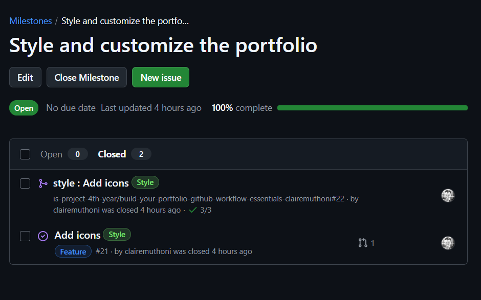

# Personal Portfolio Documentation

## 1. Student Details

- **Full Name**: 136242
- **GitHub Username**: clairemuthoni
- **Email**: claire.muthoni@strathmore.edu 

## 2. Deployed Portfolio Link

- **GitHub Pages URL**:  
https://is-project-4th-year.github.io/build-your-portfolio-github-workflow-essentials-clairemuthoni/

## 3. Learnings from the Git Crash Program

- **Branching**: Helped me separate features and prevent conflicts when working on different sections of the site.
- **Merging**: I have learned different ways of merging,such as squash and merge. I have also learned how to rebase. 
- **Commit**: I have learned how to write good and effective commit messages. This has helped me with tracking issues, and keeping good track of my code. 
- **Issues**: This has been my first time working with issues. And I realize it helps track the small tasks that are required to be accomplished to accomplish a bigger goal. 
- **Milestones**: These are the goals of the project. Like elements or things that should be achieved before a certan deadline. 

## 4. Screenshots of Key GitHub Features

### A. Milestones and Issues

### B. Project Board

### C. Branching

### D. Pull Requests

### E. Merge Conflict Resolution

